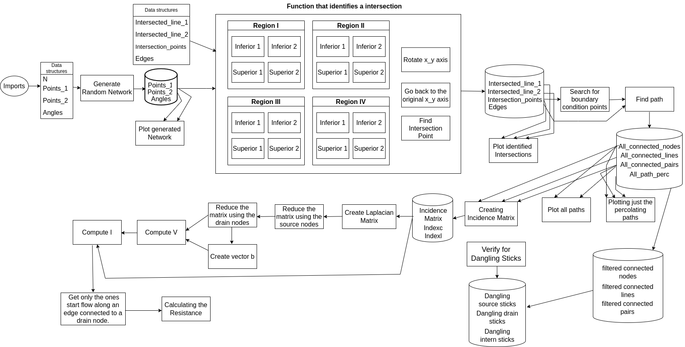

# Thin-Film Resistor CAD Tool

## Overview

Welcome to the Thin-Film Resistor CAD Tool repository! This project aims to develop a computer-aided design (CAD) tool for thin-film resistors made from materials that create a random network of short conducting connections, such as polymers, nanowires, or nanotubes. The primary goals of this project are to generate Random-Line-Graphs (RLGs) using the Monte Carlo Method, analyze the connectivity of these RLGs, and solve the graph Laplacian with weighted edges to create a stick-percolation model for thin-film resistors.

## Project Objectives

The specific objectives of this project include:

1. **Identify Percolation Pathways**: Determine the value of 'N' and value of 'a' at which percolation pathways begin to exist within the thin-film resistor network. This is a critical threshold for the functionality of the resistor.
   
2. **Compute Impedance**: Develop algorithms to compute the impedance of the conducting pathways within the thin-film resistor network. This step is crucial for understanding the electrical behavior of the resistor.

## Flowchart Of The Stick-percolation Model


## Getting Started

To get started with this project, follow these steps:

1. **Clone the Repository**: Clone this GitHub repository to your local machine using the following command:

   ```
   git clone https://github.com/jc-costa/Stick_Percolation_Model.git
   ```
   or
   ```
   git clone git@github.com:jc-costa/Stick_Percolation_Model.git
   ```

2. **Dependencies**: Make sure you have all the necessary dependencies installed. Check the project's documentation for a list of required libraries and packages.

3. **Usage**: Refer to the project's documentation or README files for detailed instructions on how to use the CAD tool. This should include information on how to generate RLGs, compute impedance, and identify percolation pathways.

## Contributing

We welcome contributions from the open-source community to help improve and extend this CAD tool. If you're interested in contributing, please follow these guidelines:

1. Fork the repository to your GitHub account.
2. Create a new branch for your contribution: `git checkout -b feature/your-feature`.
3. Make your changes and commit them with descriptive commit messages.
4. Push your changes to your fork: `git push origin feature/your-feature`.
5. Open a pull request (PR) to the main repository, explaining your changes and their significance.

## License

This project is licensed under the [MIT License](LICENSE). Please review the license file for more details.

## Contact

If you have any questions or need assistance with the project, feel free to reach out to the project maintainers or contributors via GitHub issues or other contact methods specified in the project documentation.

Thank you for your interest in the Thin-Film Resistor CAD Tool project! We look forward to your contributions and hope this tool proves valuable for your CAD needs.
